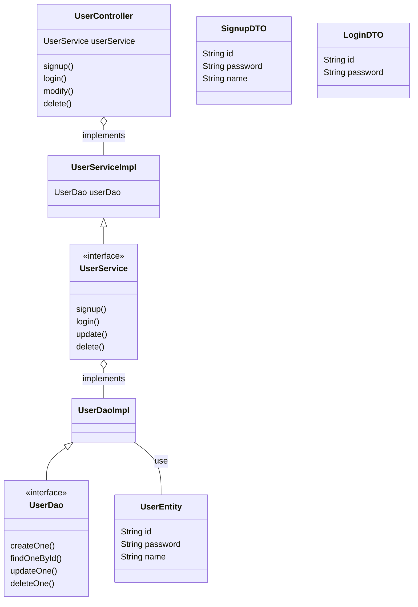

### Class diagram

```mermaid
classDiagram
    
    class UserController {
        UserService userService
        
        signup()
        login()
        modify()
        delete()
    }
    
    class UserService {
        signup()
        login()
        update()
        delete() 
        }
        
        <<interface>> UserService
        
        
    class UserServiceImpl {
        UserDao userDao
    }
    
    class UserDao {
        
    }
    
    <<interface>> UserDao
    
    class UserDao {
        createOne()
        findOneById()
        updateOne()
        deleteOne()
    }
    
    class UserDaoImpl {
        
    }
    
    class UserEntity {
        String id
        String password
        String name
    }
    
    class SignupDTO {
        String id
        String password
        String name
    }
    
    class LoginDTO {
        String id
        String password
    }

    UserServiceImpl <|-- UserService
    UserController o-- UserServiceImpl : implements
    
    UserDaoImpl <|-- UserDao
    UserService o-- UserDaoImpl : implements
    
    UserDaoImpl -- UserEntity : use
%%    UserController -- SignupDTO : use 
%%    UserController -- LoginDTO : use
%%    
%%    UserServiceImpl -- SignupDTO : use
%%    UserServiceImpl -- LoginDTO : use
        


```